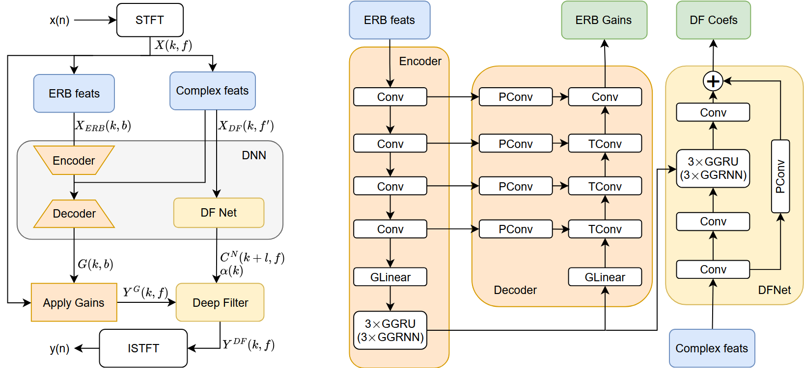

# Speech Enhancement Algorithms for Low-Resource Devices

We investigate parameter-efficient modifications of DeepFilterNet by replacing GRU blocks with FastGRNN and exploring alternative convolutional designs. Our approach significantly reduces the model size while preserving comparable speech enhancement quality. See the [paper](https://github.com/runtime57/speech_enhancement/blob/main/paper/SpeechEnhancementAlgorithmsForLowResourceDevices.pdf) for details.



## Audio Samples

We provide an interactive demo with qualitative comparisons between the noisy signal, the original DeepFilterNet, and our proposed lightweight models.

Access the demo page [here](https://runtime57.github.io/speech_enhancement/).

All the source code for demo page can be found in `demo` branch.

## Installation

0. Create and install [`conda`](https://conda.io/projects/conda/en/latest/user-guide/getting-started.html) environment

    ```
    conda create -n speech_enhancement python=3.8 -y
    conda activate speech_enhancement
    ```

1. Clone this repository

    ```
    git clone git@github.com:runtime57/speech_enhancement.git
    cd speech_enhancement
    ```

2. Install all required packages
    ```
    pip install -r requirements.txt
    ```
3. Install pre-commit
    ```
    pre-commit install
    ```

## Experimental setup

For both training and evaluation, we used the [VCTK+DEMAND](https://datashare.ed.ac.uk/handle/10283/2791) dataset, which is widely used in speech enhancement research as a standard benchmark, which allows for direct comparison between different methods.

Configurations for all types of used baselines are listed in `src/configs/model`. Feel free to conduct your own experiments by changing used model in `src/configs`.


## Train and inference
 

To train a new model, use the following command:
```
python3 train.py -cn=CONFIG_NAME HYDRA_CONFIG_ARGUMENTS
```
Where `CONFIG_NAME` is a config from `src/configs` and `HYDRA_CONFIG_ARGUMENTS` are optional arguments

To run inference (evaluate the model or save predictions):
```
python3 inference.py -cn=CONFIG_NAME HYDRA_CONFIG_ARGUMENTS  # for metrics
python3 tech_eval.py  # for params, MACs and other technical metrics. Choose the model in tech_eval.yaml
```

use `from_pretrained` field in a `{model_name}.yaml` file to load the checkpoint you need from `models/{model_name}`.

## Results on VCTK+DEMAND dataset


| Model           | Params (M) | MACs (G) | PESQ    | STOI    | SI-SDR   |
|----------------|-----------:|---------:|--------:|--------:|---------:|
| Original DFNet | 1.78       | 0.35     | **2.81** | **0.94** | 16.63    |
| Our DFNet      | 1.69       | 0.51     | 2.31    | 0.93    | **17.04** |
| FastDFNet      | 1.04       | 0.34     | 2.26    | 0.93    | 17.00    |
| Rebalanced-1   | **1.03**   | 0.25     | 2.21    | 0.92    | 16.53    |
| Rebalanced-2   | 1.09       | 0.21     | 2.24    | 0.92    | 16.83    |
| Rebalanced-3   | 1.15       | **0.19** | 2.16    | 0.92    | 16.49    |
| DWS            | 1.04       | 0.32     | 2.25    | 0.93    | 16.86    |
| MB             | 1.08       | 0.52     | 2.24    | 0.93    | 16.96    |
| Conv           | 1.11       | 0.68     | 2.25    | 0.93    | 16.97    |
| XDWS           | 1.11       | 0.32     | 2.24    | 0.92    | 16.71    |
| XMB            | 1.17       | 0.50     | 2.25    | 0.93    | 16.79    |
| XConv          | 1.12       | 0.68     | 2.26    | 0.93    | 16.77    |


Best values per column are highlighted in **bold**.
Due to limited computational and storage resources, we did not evaluate our models on the DNS Challenge dataset.

## Future work

- Benchmark on DNS Challenge dataset for better comparability with recent methods
- Explore GAN-based training to improve perceptual quality (e.g., PESQ)